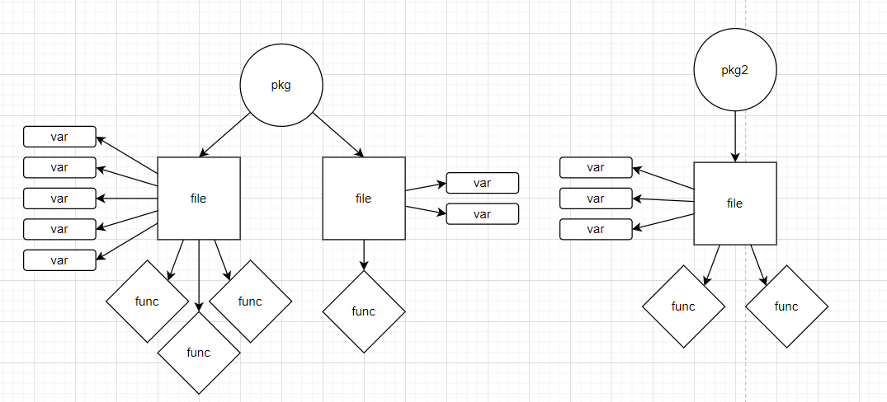

# GoDoc

Automatic documentation generator for Go. Leave GoDoc comment blocks throughout your code and have GoDoc generate a documentation for you!

GoDoc reads specially formatted comments to save information about your project for generating your doc.


**Signify a comment is meant for GoDoc by using three asterisks (`/***`) at the start of the comment block instead of a single asterisk (`/*`).**

- **GoDoc comment:**
  ```go
  /*** <---
      -- FILE
      @file myfile.go
      @description My description
      ...
  */
  ```
- **Regular multi-line comment in Go:**
  ```go
    /* <---
        This is my comment
        It has multiple lines
    */
  ```

Reserved comment keywords, or tags, are prefixed with `@`, similar to Doxygen.

At the top of your comment block, start with `-- TYPE`, where `TYPE` is the type of comments you're making.

- Example: If you are making a block of file-level comments, put `-- FILE` at the top of your comment block.

GoDoc gives you shorter options for identifiers, since writing 'dependency' over and over again is infurating. For example:

- `-- PACKAGE` & `-- PKG` are evaluated the same
- `@dep` & `@dependency` are evaluated the same
- Even `@package` & `@name` are evaluated the same within package comment blocks
- Look at the information on types of comments for more information on these shorthand options

## Types of GoDoc comment blocks:

\*Some identifiers have options for shorthand tag names. If you want verbose comments in your source, use the full tag names, but it will not affect the generation of documentation if you use shorthands.

- ## Package:
  - Contains basic, high-level information about a Go package.
  - **Headers**:
    - `PACKAGE`, `PKG`, `P`
  - **Tags**:
    - `@package`, `@pkg`, `@name`, `@p`
      - Name of the package
    - `@description`, `@desc`
      - Description of the package
    - `@usage`, `@u`
      - How the package is implemented in the project
    - `@dependency`, `@dep`
      - A single dependancy imported to the package
      - Contained within a `@dependencies`, `@deps` tag
      - Consists of "(dependancyName)" and "Dependancy description"
  - **Example**:
    - ```go
        /***
            -- PKG
            @pkg myPackage
            @desc This package contains functionality.
            @usage Use this package by doing X.
            @dep (someDependency) This package depends on dependency X.
            @dep (someDependency2) This package also depends on dependency Y.
        */
      ```
- ## File
  - Contains basic, high-level information about a file.
  - **Headers**:
    - `FILE`
  - **Tags**:
    - `@file`, `@name`, `@f`
      - Name of the file (not the path)
        - `main.go`
    - `@description`, `@desc`
      - Description of the file's purpose or features
    - `@author`, `@auth`, `@a`
      - Author of the file
    - `@version`, `@v`
      - Version of the file
        - Value set by you, not generated by GoDoc
    - `@date`, `@d`
      - Last time the file was updated
  - **Example**:
    - ```go
        /***
            -- FILE
            @f myFile.go
            @desc This file contains functionality.
            @auth John Smith
            @v 1.2
            @date 01/01/2024
        */
      ```
- ## Type
  - Contains information about the type's name, description, and fields.
  - **Headers**:
    - `TYPE`, `T`
  - **Tags**:
    - `@type`, `@t`
      - Name of the type
    - `@description`, `@desc`
      - Description of the type
    - `@field`, `@f`
      - Singular field in the type. Contained within a `@fields`, `@fs` tag
  - **Example**:
    - ```go
        /***
            -- TYPE
            @type myClass
            @desc This type wraps information and has some functions.
            @field myField1 (string): This field is needed for the type.
            @field myField2 (int): This field is needed for the type.
        */
      ```
- ## Function
  - **Headers**:
    - `FUNCTION`, `FUNC`
  - **Tags**:
    - `@function`, `@func`, `@f`, `@name`
      - Name of the function
    - `@description`, `@desc`
      - Description of the function
    - `@receiver`, `@rec`
      - Reicever for the function
      - Example:
        - ```go
          func (u *User)<---- UpdateFirstName(newFirstName string) {
              u.FirstName = newFirstName
          }
          ```
    - `@parameter`, `@param`, `@p`
      - Parameter sent to the function
      - Contained within a `@parameters`, `@params`, `@ps` tag
    - `@return`, `@ret`
      - Value returned from the function
      - Contained within a `@returns`, `@rets` tag
    - `@response`, `@res`
  - **Example**:
    - ```go
        /***
            -- FUNC
            @func myFunction
            @desc This function does a thing.
            @rec myClass
            @param myParam1 (string): This param is needed for the function.
            @param myParam2 (int): This param is needed for the function.
            @ret (error): Contains any error generated from the function.
            @res (200): Signifies a successful response.
            @res (403): Signifies an authorization error.
            @res (400): Catch-all error message.
        */
      ```
- ## Variable
  - **Headers**:
    - `VARIABLE`, `VAR`, `V`
  - **Tags**:
    - `@variable`, `@var`, `@v`, `@name`
      - Name of the variable
    - `@type`, `@t`
      - Data type of the variable
    - `@description`, `@desc`
      - Description of the variable
  - **Example**:
    - ```go
        /***
            -- VAR
            @v myClass
            @desc This type wraps information and has some functions.
            @field myField1 (string): This field is needed for the type.
            @field myField2 (int): This field is needed for the type.
        */
      ```

## How does GoDoc work?
GoDoc parses your formatted source comments into a data structure of 'nodes':

<div style="text-align: center;">
    
</div>

*Note: This tree isn't fully comprehensive (for easy readability) and each 'node' in the tree contains metadata.

Then, this data structure is easily traversed to generate markdown. This works exactly like a compiler, but with only comments.